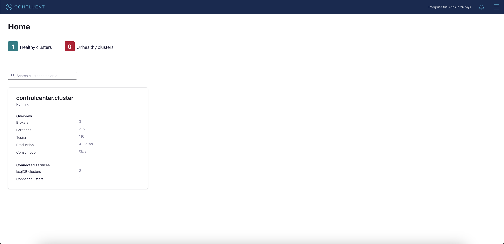
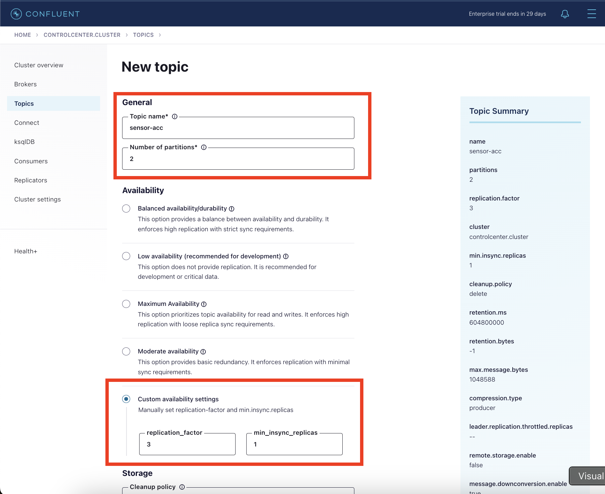
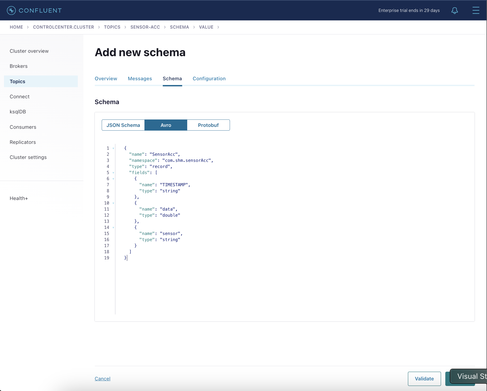
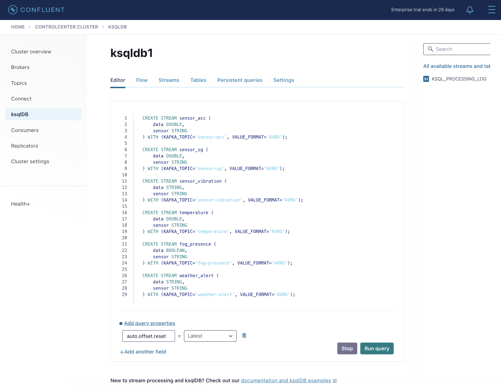

# Resource for Bridge SHM Use Case Demonstration

### Prerequisites:
- Established Blueprint Implementation ([Docker](../deployment/docker/README.md) / [Infrastructure as Code](../deployment/terraform/README.md))


## Step By Step Demonstrations

### 1. go to control center
- <http://localhost:9021> for docker or
- <http://{control-center-ip}:9021> for Infrastructure as Code



### 2.  setup topics
  - **sensor-acc** -> 2 partitions , 3 replicas, 1 min_insync_replicas
  - **sensor-sg** -> 2 partitions, 3 replicas, 1 min_insync_replicas
  - **sensor-vibration** -> 2 partition, 3 replicas, 1 min_insync_replicas
  - **temperature** -> 2 partitions, 3 replicas, 1 min_insync_replicas
  - **fog-presence** -> 2 partitions, 3 replicas, 1 min_insync_replicas
  - **weather-alert** -> 2 partitions, 3 replicas, 1 min_insync_replicas



### 3. Setup schemas

**sensor-acc**
```json
{
  "name": "SensorAcc",
  "namespace": "com.shm.sensorAcc",
  "type": "record",
  "fields": [
    {
      "name": "TIMESTAMP",
      "type": "string"
    },
    {
      "name": "data",
      "type": "double"
    },
    {
      "name": "sensor",
      "type": "string"
    }
  ]
}
```
**sensor-sg**
```json
{
  "name": "SensorSg",
  "namespace": "com.shm.sensorSg",
  "type": "record",
  "fields": [
    {
      "name": "TIMESTAMP",
      "type": "string"
    },
    {
      "name": "data",
      "type": "double"
    },
    {
      "name": "sensor",
      "type": "string"
    }
  ]
}
```
**sensor-vibration**
```json
{
  "name": "SensorVibration",
  "namespace": "com.shm.sensorVibration",
  "type": "record",
  "fields": [
    {
      "name": "TIMESTAMP",
      "type": "string"
    },
    {
      "name": "data",
      "type": "string"
    },
    {
      "name": "sensor",
      "type": "string"
    }
  ]
}
```

**temperature**
```json
{
  "name": "SensorTemperature",
  "namespace": "com.shm.sensorTemperature",
  "type": "record",
  "fields": [
    {
      "name": "TIMESTAMP",
      "type": "string"
    },
    {
      "name": "data",
      "type": "double"
    },
    {
      "name": "sensor",
      "type": "string"
    }
  ]
}
```
**fog-presence**
```json
{
  "name": "SensorFogPresence",
  "namespace": "com.shm.sensorFogPresence",
  "type": "record",
  "fields": [
    {
      "name": "TIMESTAMP",
      "type": "string"
    },
    {
      "name": "data",
      "type": "boolean"
    },
    {
      "name": "sensor",
      "type": "string"
    }
  ]
}
```

**weather-alert**
```json
{
  "name": "SensorWeatherAlert",
  "namespace": "com.shm.sensorWeatherAlert",
  "type": "record",
  "fields": [
    {
      "name": "TIMESTAMP",
      "type": "string"
    },
    {
      "name": "data",
      "type": "string"
    },
    {
      "name": "sensor",
      "type": "string"
    }
  ]
}
```


### 4. Create Stream Processor in KsqlDB for Anomalies Detection and Data Fusion


Use the below queries for creating a statistical anomalies detection as mentioned in the paper 

#### 4.1. Create stream for each sensor
```sql
CREATE STREAM sensor_acc (
    TIMESTAMP STRING,
    data DOUBLE,
    sensor STRING
) WITH (KAFKA_TOPIC='sensor-acc', VALUE_FORMAT='AVRO');

CREATE STREAM sensor_sg (
    TIMESTAMP STRING,
    data DOUBLE,
    sensor STRING
) WITH (KAFKA_TOPIC='sensor-sg', VALUE_FORMAT='AVRO');

CREATE STREAM sensor_vibration (
    data STRING,
    sensor STRING
) WITH (KAFKA_TOPIC='sensor-vibration', VALUE_FORMAT='AVRO');

CREATE STREAM temperature (
    data DOUBLE,
    sensor STRING
) WITH (KAFKA_TOPIC='temperature', VALUE_FORMAT='AVRO');

CREATE STREAM fog_presence (
    data BOOLEAN,
    sensor STRING
) WITH (KAFKA_TOPIC='fog-presence', VALUE_FORMAT='AVRO');

CREATE STREAM weather_alert (
    data STRING,
    sensor STRING
) WITH (KAFKA_TOPIC='weather-alert', VALUE_FORMAT='AVRO');

```
#### 4.2. Create stream for timestamp alignment
```sql

CREATE STREAM sensor_acc_aligned AS
SELECT
    TIMESTAMP,
    FLOOR(ROWTIME / 100) * 100 AS EVENT_TIMESTAMP,
    data,
    sensor
FROM sensor_acc
    EMIT CHANGES;

CREATE STREAM sensor_sg_aligned AS
SELECT
    TIMESTAMP,
    FLOOR(ROWTIME / 100) * 100 AS EVENT_TIMESTAMP,
    data,
    sensor
FROM sensor_sg
    EMIT CHANGES;

CREATE STREAM sensor_vibration_aligned AS
SELECT
    FLOOR(ROWTIME / 100) * 100 AS EVENT_TIMESTAMP,
    data,
    sensor
FROM sensor_vibration
         EMIT CHANGES;

CREATE STREAM temperature_aligned AS
SELECT
    FLOOR(ROWTIME / 100) * 100 AS EVENT_TIMESTAMP,
    data,
    sensor
FROM temperature
         EMIT CHANGES;

CREATE STREAM fog_presence_aligned AS
SELECT
    FLOOR(ROWTIME / 100) * 100 AS EVENT_TIMESTAMP,
    data,
    sensor
FROM fog_presence
         EMIT CHANGES;

CREATE STREAM weather_alert_aligned AS
SELECT
    FLOOR(ROWTIME / 100) * 100 AS EVENT_TIMESTAMP,
    data,
    sensor
FROM weather_alert
         EMIT CHANGES;

```

#### 4.3. Acc sensor stats calculation
```sql
CREATE TABLE sensor_acc_stats AS
SELECT
    sensor,
    AVG(data) AS avg_data,
    STDDEV_SAMPLE(data) AS std_data,
    AVG(data) + 2 * STDDEV_SAMPLE(data) AS upper_threshold,
    AVG(data) - 2 * STDDEV_SAMPLE(data) AS lower_threshold
FROM sensor_acc_aligned
GROUP BY sensor
    EMIT CHANGES;
```

#### 4.4. Trigger an event whenever an anomaly detected
```sql
CREATE STREAM sensor_acc_alerts AS
SELECT
    a.TIMESTAMP,
    a.EVENT_TIMESTAMP,
    a.sensor,
    a.data AS sensor_data,
    s.avg_data,
    s.std_data,
    s.upper_threshold,
    s.lower_threshold,
    CASE
        WHEN a.data > s.upper_threshold THEN 'upper_threshold_exceeded'
        WHEN a.data < s.lower_threshold THEN 'lower_threshold_exceeded'
        ELSE 'normal'
        END AS status
FROM sensor_acc_aligned a
         LEFT JOIN sensor_acc_stats s
                   ON a.sensor = s.sensor
WHERE a.data > s.upper_threshold OR a.data < s.lower_threshold
    EMIT CHANGES;
```
#### 4.5. Fused anomaly data with other sensor data
```sql
CREATE STREAM fused_acc_sensor_alerts AS
SELECT
    a.TIMESTAMP,
    a.EVENT_TIMESTAMP as alert_timestamp,
    a.a_sensor AS acc_sensor,
    a.sensor_data AS acc_data,
    a.status AS acc_status,
    a.upper_threshold AS upper_threshold ,
    a.lower_threshold AS lower_threshold,
    v.data AS vibration_data,
    t.data AS temperature_data,
    f.data AS fog_presence_data,
    w.data AS weather_alert_data
FROM sensor_acc_alerts a
         LEFT JOIN sensor_vibration_aligned v WITHIN 50 MILLISECONDS GRACE PERIOD 10 MILLISECONDS ON a.EVENT_TIMESTAMP = v.EVENT_TIMESTAMP
    LEFT JOIN temperature_aligned t WITHIN 50 MILLISECONDS GRACE PERIOD 10 MILLISECONDS ON a.EVENT_TIMESTAMP = t.EVENT_TIMESTAMP
    LEFT JOIN fog_presence_aligned f WITHIN 50 MILLISECONDS GRACE PERIOD 10 MILLISECONDS ON a.EVENT_TIMESTAMP = f.EVENT_TIMESTAMP
    LEFT JOIN weather_alert_aligned w WITHIN 50 MILLISECONDS GRACE PERIOD 10 MILLISECONDS ON a.EVENT_TIMESTAMP = w.EVENT_TIMESTAMP
    EMIT CHANGES;
```
#### 4.6. Strain Gauges sensor stats calculation
```sql
CREATE TABLE sensor_sg_stats AS
SELECT
    sensor,
    AVG(data) AS avg_data,
    STDDEV_SAMPLE(data) AS std_data,
    AVG(data) + 2 * STDDEV_SAMPLE(data) AS upper_threshold,
    AVG(data) - 2 * STDDEV_SAMPLE(data) AS lower_threshold
FROM sensor_sg_aligned
GROUP BY sensor
    EMIT CHANGES;
```

#### 4.7. Trigger an event whenever an anomaly detected
```sql
CREATE STREAM sensor_sg_alerts AS
SELECT
    a.TIMESTAMP,
    a.EVENT_TIMESTAMP,
    a.sensor,
    a.data AS sensor_data,
    s.avg_data,
    s.std_data,
    s.upper_threshold,
    s.lower_threshold,
    CASE
        WHEN a.data > s.upper_threshold THEN 'upper_threshold_exceeded'
        WHEN a.data < s.lower_threshold THEN 'lower_threshold_exceeded'
        ELSE 'normal'
        END AS status
FROM sensor_sg_aligned a
         LEFT JOIN sensor_sg_stats s
                   ON a.sensor = s.sensor
WHERE a.data > s.upper_threshold OR a.data < s.lower_threshold
    EMIT CHANGES;
```
#### 4.8. Fused anomaly data with other sensor data
```sql
CREATE STREAM fused_sg_sensor_alerts AS
SELECT
    a.TIMESTAMP,
    a.EVENT_TIMESTAMP as alert_timestamp,
    a.a_sensor AS sg_sensor,
    a.sensor_data AS sg_data,
    a.status AS sg_status,
    a.upper_threshold AS upper_threshold ,
    a.lower_threshold AS lower_threshold,
    v.data AS vibration_data,
    t.data AS temperature_data,
    f.data AS fog_presence_data,
    w.data AS weather_alert_data
FROM sensor_sg_alerts a
         LEFT JOIN sensor_vibration_aligned v WITHIN 50 MILLISECONDS GRACE PERIOD 10 MILLISECONDS ON a.EVENT_TIMESTAMP = v.EVENT_TIMESTAMP
    LEFT JOIN temperature_aligned t WITHIN 50 MILLISECONDS GRACE PERIOD 10 MILLISECONDS ON a.EVENT_TIMESTAMP = t.EVENT_TIMESTAMP
    LEFT JOIN fog_presence_aligned f WITHIN 50 MILLISECONDS GRACE PERIOD 10 MILLISECONDS ON a.EVENT_TIMESTAMP = f.EVENT_TIMESTAMP
    LEFT JOIN weather_alert_aligned w WITHIN 50 MILLISECONDS GRACE PERIOD 10 MILLISECONDS ON a.EVENT_TIMESTAMP = w.EVENT_TIMESTAMP
    EMIT CHANGES;
```

### 5. Run consumer script
go to ./producer folder
```shell
cd consumer
```
create a python virtual environment
```shell
python3 -m venv myenv
```
Activate virtual environment
```shell
source myenv/bin/activate
```
Install required libraries
```shell
pip install csv, os, confluent_kafka, 
```
Run producer Script
```shell
python3 data_streamer.py
```

### 6. Run producers script
go to ./producer folder
```shell
cd producer
```
create a python virtual environment
```shell
python3 -m venv myenv
```
Activate virtual environment
```shell
source myenv/bin/activate
```
Install required libraries
```shell
pip install pandas,os,time,json,asyncio,concurrent,datetime,confluent_kafka
```
Run producer Script
```shell
python3 main.py
```

### 7. Wait until all data points are properly sent


### 8. Plot the input and output data
go to ./consumer/plotter folder
```shell
cd producer
```
create a python virtual environment
```shell
python3 -m venv myenv
```
Activate virtual environment
```shell
source myenv/bin/activate
```
Install required libraries
```shell
pip install pandas,matplotlib, seaborn
```
Run producer Script
```shell
python3 main.py
```
